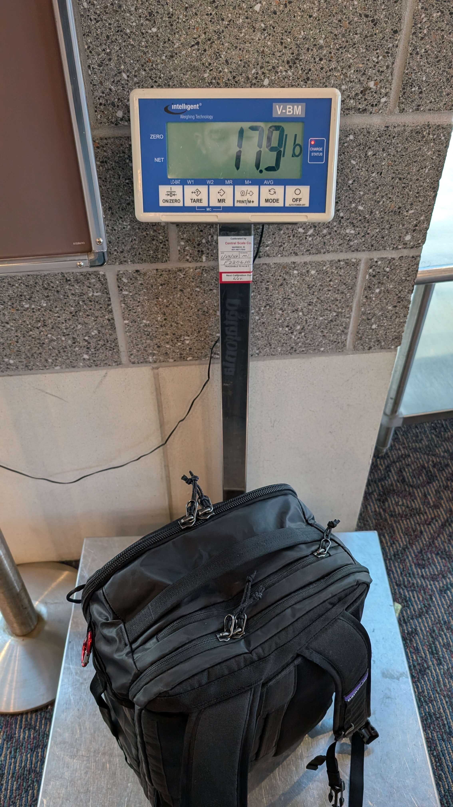
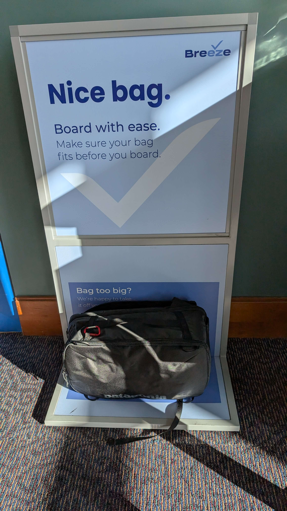
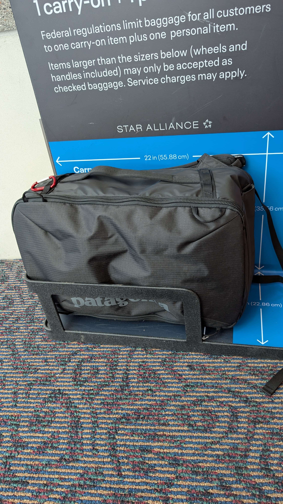
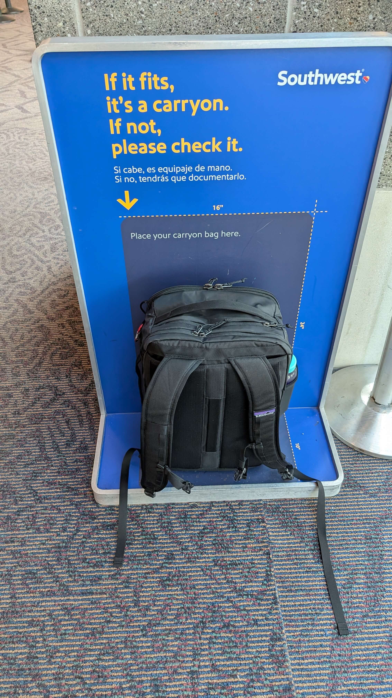
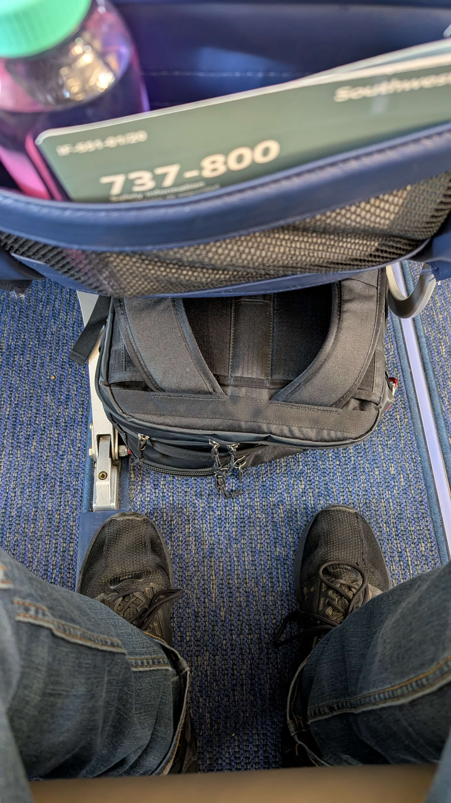
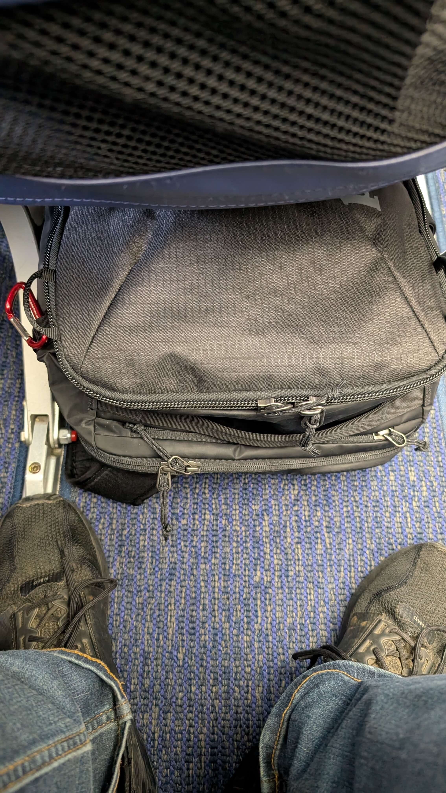
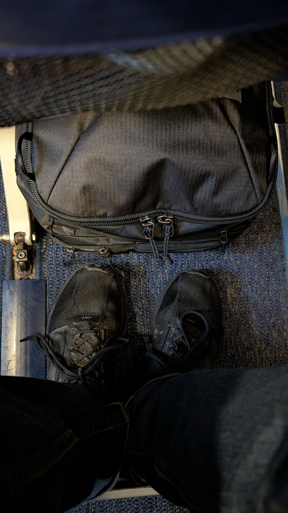
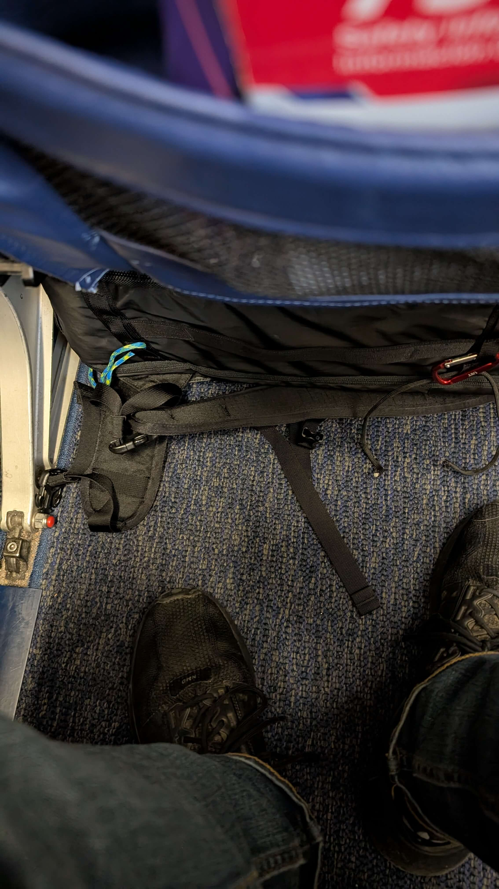
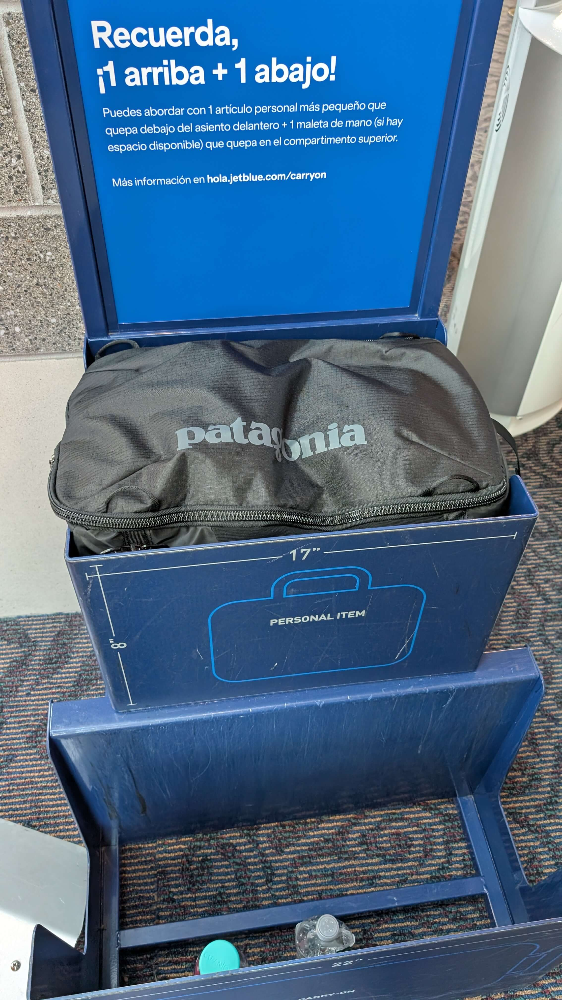

# Patagonia Mini MLC 30L Packing and Sizing Data Points

This was primarily a test run with the Patagonia Mini MLC 30L.
I'm visiting family in my home town via Southwest, so it was a low stress trip that I knew I had the ability to bring two bags on the plain with me.

I want to primarily use the bag as a personal item, but I had seen mixed accounts of the viability. Using as an overhead carryon isn't out of the question and I'll pay for it when required in the future.

I figured others may benefit from this as well, so I captured a few different images of how the bag fit in the sizers when almost fully packed.

## What's in the bag?

The bag fully packed with an empty water bottle weighed in at 17.9lbs (8.1kg).

### Packing list:

Clothes:

* Tee shirt (3)
* Underwear (4)
* Socks (2) - Darn Tough
* Flannel shirt

All in a Peak Design small packing cube. This thing rules. I was hesitant due to the price, but when it was on sale, I figured I'd try it. It's notably smaller than the packing cube I was going to use before it came in while fitting the same amount. Big fan.

Toiletries:

* Electric toothbrush
* Floss
* Retainer
* Nail clippers
* Tweezers
* Cotton swabs
* Razor
* Face wash
* AM moisturizer
* PM moisturizer
* Retinol
* Toothpaste
* Nylon wash rag
* Stick deodorant

Shampoo, conditioner, and body wash were skipped because they're available at the destination.

All in a generic Bag Smart toiletries bag. It's fine, maybe a little big, but it's a bag that holds toiletries, so it's doing its job well.

Tech:

* 14in M2 Mac Book Pro (work machine)
* 13in Framework AMD (personal)
* Kobo Clara BW
* 65w charging block
* 10k mah battery bank
* Misc adapters and cables
* Bose QC25s with an eBay Bluetooth adapter - had them for almost ten years and they're great

I would love to not carry two laptops. I really didn't need my personal machine, but I figured it would be worth testing carrying it and I like to have some flexibility (like writing this).

Misc:

* Packable tote
* Eye mask
* Medication tin
* Bandana
* Sewing/repair kit
* 3x5in notebook
* Pen and pencil

Wearing:

* Tee shirt
* Sweatshirt
* Underwear
* Socks
* Two insulated jackets that I layer
* Sneakers

### Optimizations:

A big easy win (space wise) would be replacing the headphones with ANC earbuds. Not sure if they can compare, but these are old headphones so I wouldn't be surprised if there have been a lot of advancements. I'll do some research here, but it looks like the highly recommended ones float closer to $200, which is a lot to replace something that works so well for me.

If I can just remove them from my bag and keep them around my neck during travel, that would work too. Not sure how feasible.

Another obvious one is to only have one machine (likely my work machine since I often travel and work during my trips).

I could do with only two packed shirts, two packed underwear, and one over shirt (sweatshirt or flannel) and do laundry more frequently.

## Airline Sizing

### American Airlines

I couldn't capture an image of American Airlines because all of the sizers were behind ropes, but a gate attendent let me run over and check real quick. It fit the personal item size no problem (with a decent bit of height left).

### Breeze

Never flown Breeze, so I'm not sure how they do it, but there was only one size (that appears to be the carry on) and it was obviously not an issue. Not sure if they have a separate personal item block.

### United Airlines (maybe all of Star Alliance?)

Slightly over in length and width. If they allow you to compress the bag at all, this wouldn't be an issue as a personal item.

### Southwest

Southwest doesn't seem to care about your person item at all since you get a carry on included as well. I've flown Southwest quite a bit my entire life and I've never seen them comment on anyone's bag (I'd argue they're _too_ loose with what they allow people to carry on after also allowing two checked bags free).

One issue is that they will often fill up the overhead bins early, so they'll begin gate checking carry ons, so I really wanted this to fit under the seat.

I like to sit in the aisle seat and Southwest has a more narrow space for personal items for all aisle seats. Width and height wise, it fit with plenty of room to spare. Depth looks good to me since it's behind the ends of the seat posts, but I could see an argument otherwise.

For what it's worth, I asked the flight attendant she assured me it was good to go as a personal item back when I showed her how it fit.

You can see that it limits leg room, so if I was flying longer than some short flights, it's go over head, but this is one of the few times being shorter has benefits!

One observation I made is that if you're on the plane late enough to have to gate check, you're going to be stuck with a middle seat. The silver lining there is that the middle seat has a wider under seat space that I've seen others post online that the Mini MLC can fit sideways in, making depth not an issue.

Example: https://www.reddit.com/r/onebag/comments/1abopnx/underseat_patagonia_mini_mlc_30/

This third one specifically is the one I got confirmation from the flight attendant on.
I made sure to move my feet so it could be compared to the feet of the chair it's under.

**Update:** I was able to try it on the window and middle seat on the way back.
It fit sideways very easily with some wiggle room.
This was great and it left a good bit of room for legs.

 

### Jet Blue

It ended up sticking out a bit over the top, but if I added a compression strap/tie, we're looking in the clear. This is also probably due to the straps being bent and pushing the bag up. If I tucked them away, I think this would be better.

### Frontier

On the return flight, I was able to measure the bag in a Frontier bag sizer.

With how full it was, it required a small amount of force.
If it was packed a little less, then it likely would've slid in.

